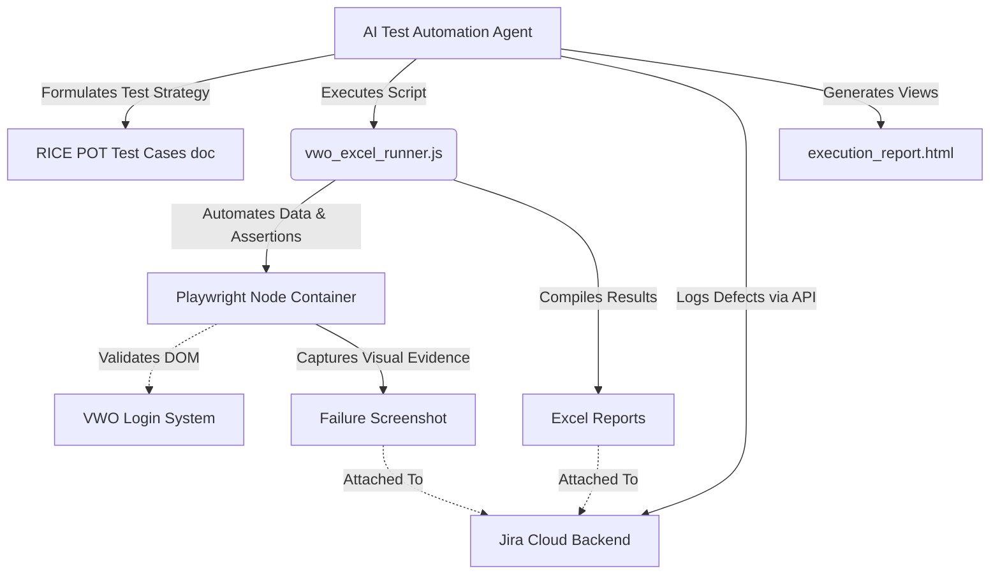
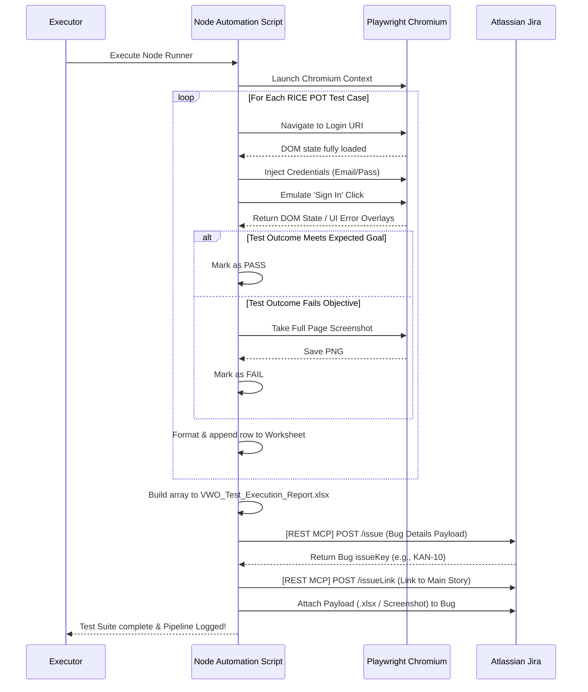

# Automated QA & Defect Logging with MCP, Playwright & Jira

This repository demonstrates an end-to-end automated testing workflow using **Playwright** for UI automation, structured test case generation via the **RICE POT method**, and automated defect tracking pushed directly to **Jira** utilizing the Model Context Protocol (MCP).

## 🚀 Features

*   **RICE POT Methodology:** Formalized test cases documented for VWO Login (Validity, Negative scenarios, Internationalization).
*   **Playwright Automation:** Headless/Headed UI testing with automated data input, assertions, and screenshot capturing on failure.
*   **Excel Reporting:** Dynamic aggregation of test outcomes into a consolidated `.xlsx` file (`exceljs`).
*   **Automated Jira Integration:** System-driven instantiation of bugs in Jira, linked to primary stories, paired automatically with failure logs and screenshots via Atlassian's API.
*   **HTML Dashboard:** Comprehensive, stylized single-page HTML report indexing conversation history and results.

## 📐 Architecture Diagram



## 🔄 Workflow Execution Sequence



## 🛠️ Installation & Setup

1.  **Clone the Repository:**
    ```bash
    git clone https://github.com/nagarjunabhr8/Bug-Creation-using-MCP-Playwright-JIRA.git
    cd Bug-Creation-using-MCP-Playwright-JIRA
    ```

2.  **Install Dependencies:**
    ```bash
    npm install
    npx playwright install chromium
    ```

3.  **Execute the Complete Testing Pipeline:**
    ```bash
    node vwo_excel_runner.js
    ```

*(Note: Direct integration pushes to a live Jira Workspace require local Model Context Protocol definitions `mcp_config.json` supplying authorized cloud API tokens. These keys have been gitignored locally for project security).*
